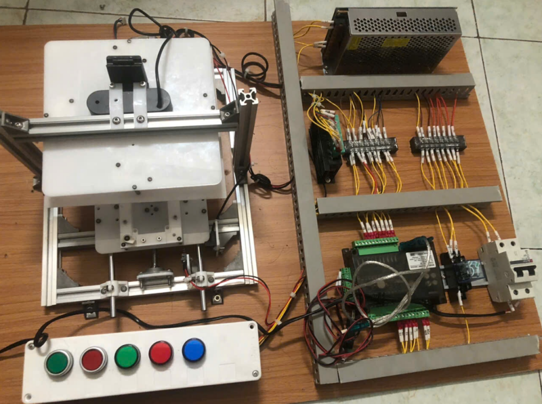
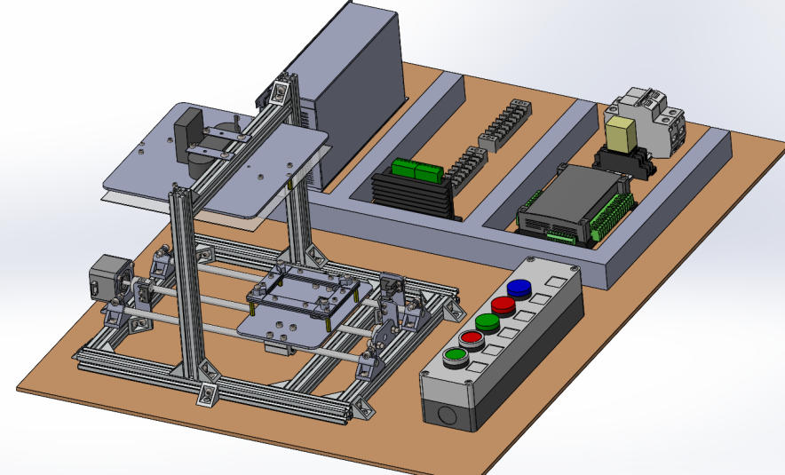
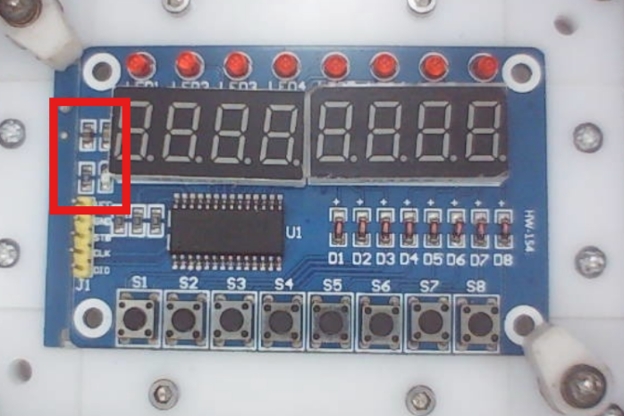
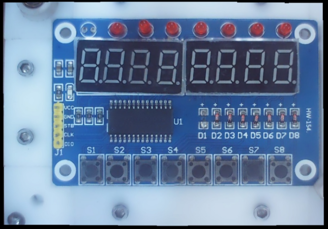
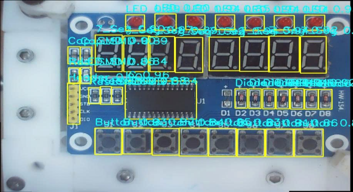
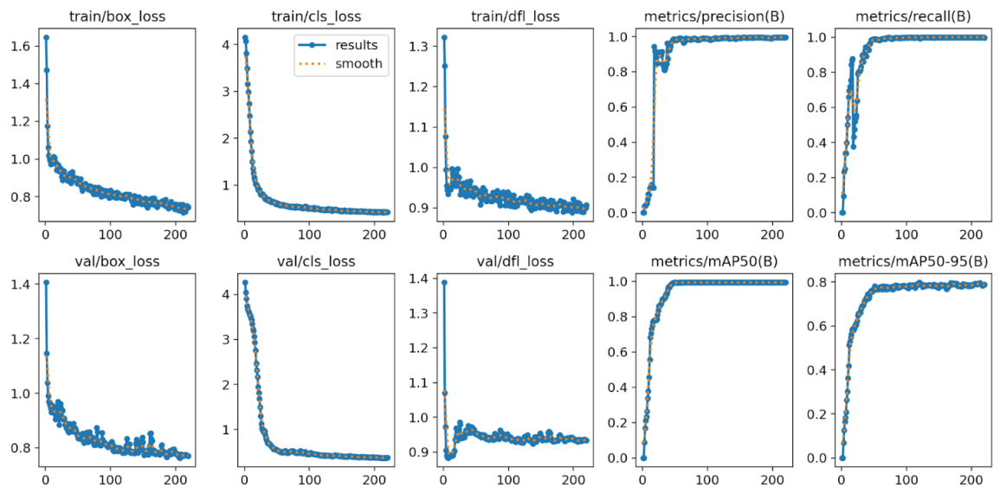
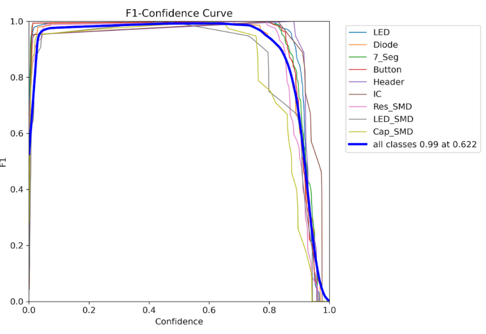
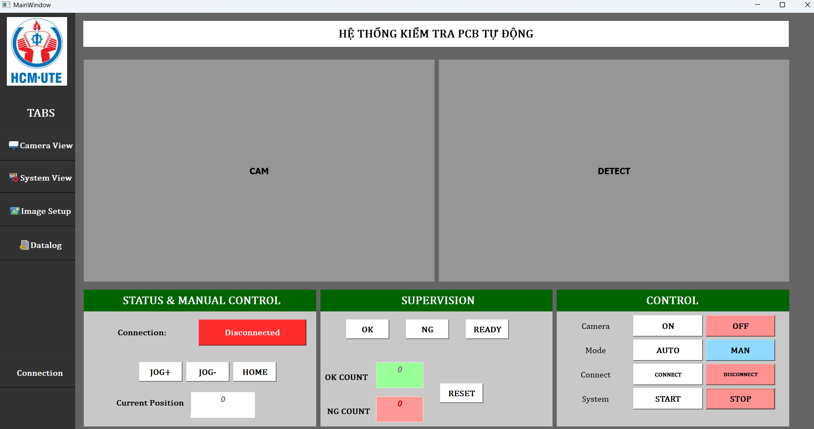
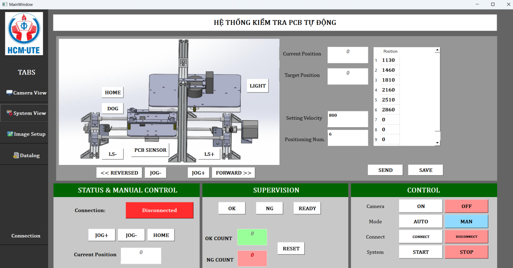

# AOI PCBA Single-Axis Inspection System

A PLC-controlled **Automated Optical Inspection (AOI)** system for detecting missing electronic components on PCBA using **single-axis motion control, OpenCV image stitching, YOLO, Modbus RTU, and Python/PyQt5**.

<p align="center">
  
  <br>
  <em>Figure 1. Overall AOI PCBA Single Axis Inspection System.</em>
</p>

<p align="center">
  
  <br>
  <em>Figure 2. CAD Design of System.</em>
</p>

## Overview

The system uses a **Mitsubishi FX3U PLC** to control a single-axis stepper positioning stage. The PCBA is moved through multiple camera positions, where images are captured and stitched into a higher-resolution PCB image.

A YOLO object detection model identifies and counts electronic components. The detected quantities are compared with a reference PCB to automatically classify the board as **OK or NG** and report missing components.

The Python/PyQt5 application handles machine control, camera monitoring, PLC communication, inspection results, and data logging.

## Key Features

* Mitsubishi FX3U PLC motion control
* PLC–PC communication via Modbus RTU
* Multi-position image acquisition
* OpenCV image stitching
* YOLO component detection
* Reference-based missing-component inspection
* Automatic OK/NG classification
* Manual / Auto operation
* PyQt5 control and monitoring GUI
* Datalog and Excel export

## Computer Vision

### Image Stitching

Multiple overlapping images are captured along the linear axis and stitched into a larger PCB image, which will resolve problem of oblique viewing angles and component occlusion on PCB as shown on Figure 3a and 3b.

|  |  |
|:---:|:---:|
|  |  |
| <em>Figure 3a. Single capture.</em> | <em>Figure 3b. Stitched image.</em> |

### Component Detection

<p align="center">
  
  <br>
  <em>Figure 4. Visual Inspection Result using YOLO11n Detection Model.</em>
</p>

Detected component classes include:

`LED` · `Diode` · `7-Segment` · `Button` · `Header` · `IC` · `SMD Resistor` · `SMD Capacitor` · `SMD LED`

## YOLO Training Results

The YOLO model was trained to detect nine electronic component classes on the PCBA.

<p align="center">
  
  <br>
  <em>Figure 5. YOLO11n Model Training Diagram Results.</em>
</p>

<p align="center">
  
  <br>
  <em>Figure 6. YOLO11n Model F1 Score Diagram.</em>
</p>

## Control Software

The PyQt5 application provides:

* Camera and inspection monitoring
* JOG / HOME control
* Auto / Manual operation
* PLC connection and positioning setup
* Reference PCB capture
* OK/NG supervision
* Production counters
* Datalog and Excel export

<p align="center">
  
  <br>
  <em>Figure 7. Main GUI.</em>
</p>

<p align="center">
  
  <br>
  <em>Figure 8. System GUI.</em>
</p>

## Technologies

**Computer Vision:** OpenCV, Ultralytics YOLO, Image Stitching, Object Detection
**Programming:** Python, PyQt5, Pandas
**Automation:** Mitsubishi FX3U, Modbus RTU, TB6600, NEMA17
**Design:** SolidWorks, AutoCAD Mechanical, AutoCAD Electrical

## Repository Structure

```text
.
├── src/          # Python application
├── plc/          # PLC program
├── images/       # Project images
├── docs/         # Project report
└── README.md
```

## Installation

```bash
git clone https://github.com/YOUR_USERNAME/AOI-PCBA-Single-Axis-Inspection.git
cd AOI-PCBA-Single-Axis-Inspection

pip install -r requirements.txt
python src/main.py
```

> Full operation requires the Mitsubishi FX3U PLC, camera, stepper positioning system, and Modbus RTU connection.

## Demo

[Watch Demo Video](https://www.youtube.com/watch?v=UXka-sqkWKE)

## Project Report

[View Full Project Report](docs/BaoCaoDACDT.pdf)

## Author

**Nguyen Cong Danh**
 – Mechatronics Engineering – HCMUTE

Computer Vision · Machine Vision · PC Control · Automation
